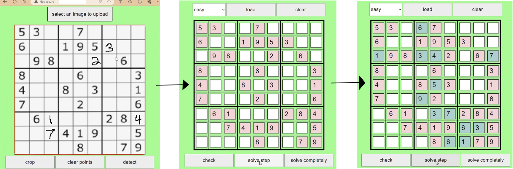

# Sudoku Solver

# TODOs
- UI:
  - [ ] hebrew interface
  - [ ] choose model (?)
  - [ ] mark mistakes
  - [ ] auto-select sudoku edges and crop
- detection: 
  - [ ] model on browser (using onnx)
  - [ ] add noise augmentation
  - [ ] train deeper models
- general: 
  - [ ] run all code on browser using JS rather on server using python
  - [ ] deploy to app engine[SudokuSolver_demo.mp4](..%2F..%2FVideos%2FSudokuSolver_demo.mp4)