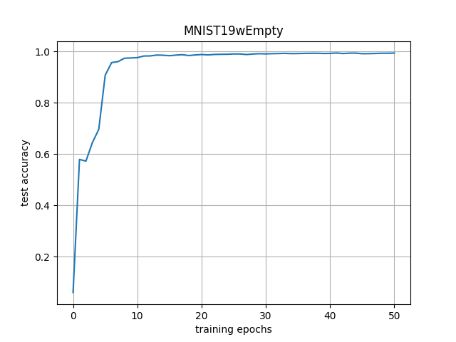
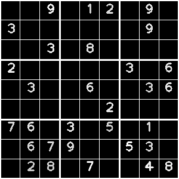
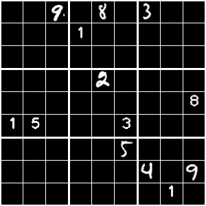
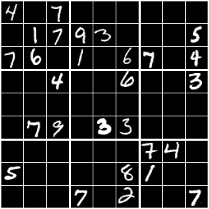

# Sudoku image detector
In this section, we develop image detector that receives an image which contains Sudoku board and replies the array of 
numbers inside, which could be solved next stage. 

## 1. [Digits classifier](digits_classifier.py)
We start by training a simple image classifier that, given a cell in the table, will return the digit in that cell 
(1-9), or will inform that this cell is empty. 

For that we use the MNIST data set, which contains 60K (train) + 10K (test) samples of handwritten digits (0-9). 

However, we don't expect to observe zeros, and we do expect to see empty cells, so we just replace all the 0's in the 
database with empty image.
Hence, we created new Dataset class named **MNIST19wNone**. 

We use a simple architecture, which commonly used on the MNIST classifiers, including 2 convolutions layers, each 
wrapped by ReLu activation and maxpooling (factor 2), and then 3 fully-connected layers.

## 2. Simulate sudoku boards for testing
We wrote a [script](data/GridNums/generator.py) which generates grids with numbers and save them alongside the 
numbers grid (empty cell denotes by zero).  

First we wanted to simulate a sudoku clean board, which contain printed digits only, and is usually pretty sparse: 

Then we also want to be able to detect all digits in a semi-solved sudoku, so we combine printed digits and hard-written 
digits from MNIST.

Since we started from training the digits classifier from MNIST, we generated also MNIST based grids: 

Note that we created white on black grid boards, following the MNIST dataset. 

## Testing
We created the class **MultiClassifier**, which basically contain a 9x9 grid of trained digits classifiers. 

For example, the output for the above MNIST-based board was: 

[4, 0, 7, 0, 0, 0, 0, 0, 0], 
[0, 1, 7, 9, 3, 0, 0, 0, 5], 
[7, 6, 0, 1, 0, 6, 7, 0, 8], 
[0, 0, 4, 0, 0, 6, 0, 0, 3], 
[0, 0, 0, 0, 0, 0, 0, 0, 0], 
[0, 7, 9, 0, 3, 3, 0, 0, 0], 
[0, 0, 0, 0, 0, 0, 7, 4, 0], 
[5, 0, 0, 0, 0, 8, 1, 0, 0], 
[0, 0, 0, 7, 0, 2, 0, 0, 7]

which succeed in 80/81 of the cells (3rd row in the end got 8 instead of 8), this is 98.8% accuracy. 
over a set of 10K such grids the accuracy was 99.0% (which is about 1/5 boards without any error, and 4/5 with one error)

However, when testing a printed and hand-writen combined boards the accuracy drops to 92% and when testing printed only 
it dops to 85%, which means if fails to classify printed digits correctly. 
Hence,  we need to train it on both hand-writen and printed digits.

So we defined a new dataset which produce both hand-writen from MNIST and printed digits with some variance in size, 
location and width. 
Unfortunately, performance dropped dramatically. When we checked why, turns out many empty cells got recognized as "1". 
We related it to the edges of the cells which did not exist on the training data, so we add them by defining a new 
augmentation class **RandomEdgeLines**. 

mnist-based: 99.1%
combined-mnist: 93%
printed: 87%

## Infer raw image
